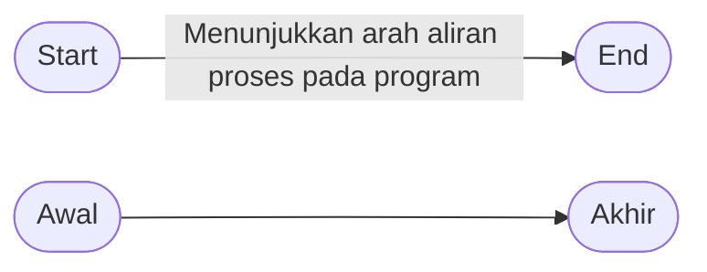

## Simbol Flowcharts
### Terminator

### Arah Aliran

### Preparation

### Proses

### Input/Output Data

### Predefined Process (subprogram)

### Kondisi (Decision)

### On Page Connector

### Off Page Connector [^opc-note]

## Jenis Flowcharts
### System Flowcharts

### Data Flowcharts [^df-note]

### Website Flowcharts

[^opc-note]: Simbol dari Off Page Connector adalah segi lima terbalik. Karena bentuk ini tidak tersedia dalam bahasa mermaid, maka diilustrasikan sebagai trapesium.
[^df-note]: Versi penuh dari Data Flowcharts yang terlihat jelas, dapat diakses melalui [kroki.io](https://kroki.io/mermaid/svg/eNp9VMGOmzAQPSdfgfbQU9lPiETFIiFtADtSpYrmQMiQWGUxtQ2rKNp_r7GJbQjUlyjjN2_mvRlT1fSzvBZMeO9468mDff_lW3PirYfhb0c4EYQ2noq8-P5OYyJkURGyt2GiSeSvAfwCbgFvKnUXBgqmoIH_OiITOgJf_R12AYtUWFKZYosUD4BqWRe2rCFaprUpw7Eg1FEBMx8MudKEgklQ_jfJCf2uU73fo5feAZrzSIqBt7ThDjtGeJVr0m06gQ0nNcCUnYGtdKy6Toeu0-DpQsYcQ5c71-Sm80KGZjAMPeFwnhg3TAUt1ltUFz3LG0401xgL-OD_UarVxiYrhJr0wG5SnTvTeLvZbDTaYuOmp6R0UPtsnX-nGfbZMMNsq4C8O11Y0V69w5XIhqtKsjG7l3nGoC0YuM_tqK6lzVOCH91Nig0u0AibH6EJA3DhVZRp14923RN8T0BOY5gKfH7ZfJTr0FMGCnI9uqAsoRXFqXZuU1NUTWCl4UPXAiONkBduz8NHIH_ri7orhu2PkFM1uAdty2gP_GuZ86eMUDZ51w8FU6YQ3UMoyVkulKBSnaBgZVvT1MXR8QNPDDEr7kDSB8LRPu7xXS-ktcyWjNI86uq6InU9T4xNN-O2OcUyWawEua5eVtw-pI0rXmsUaS7zBUljw-C8Flthn-X74s8z_T_Xk6Eq)
